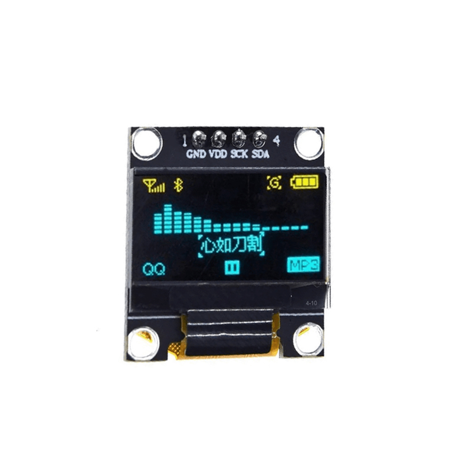
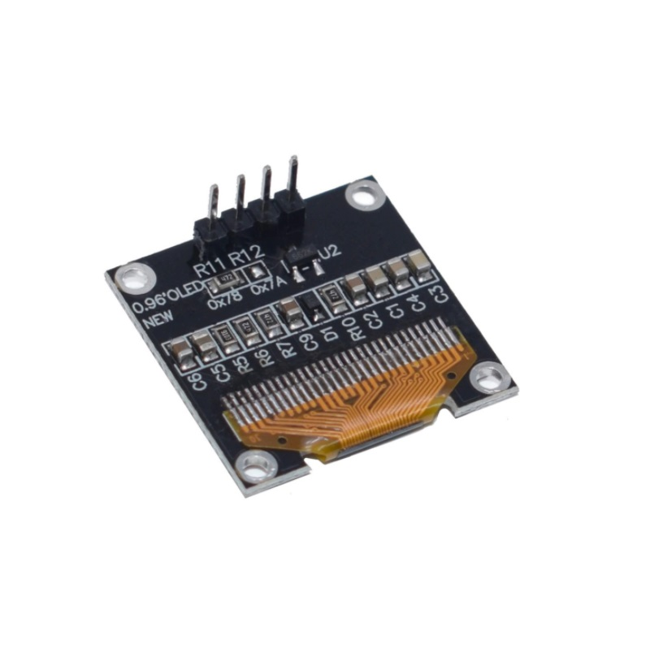

# 1.3" OLED display — SSD1306 over I²C

Each node carries a 1.3" 128×64 monochrome OLED so the message travelling over
the Ethernet link is visible without a PC attached. Host A shows what it sent;
Host B shows what it received.

The panel is a **QG-2864KSWLG01**. The datasheet packaged with the module is
internally inconsistent about the controller — see the note below — but the
real silicon on this specific module is confirmed **SSD1306**.

## Two things that will cost you a part or an evening

### Power the module from 3.3 V, not 5 V

The module is sold as a 5 V part and its silkscreen says `5V`. **Do not feed
it 5 V here.** The SDA and SCL pull-up resistors on the breakout go to the
module's own VCC, so a 5 V-powered module presents 5 V on the I²C lines. Those
lines go straight into a Cyclone IV bank running at 3.3 V, which is over its
absolute maximum.

Powering the module at 3.3 V puts the pull-ups at 3.3 V and makes the whole
thing directly FPGA-safe. This is also what the controller wants: VDD on both
SSD1306 and SH1106 is in the 1.65–3.3 V range and is specified to match the
host MPU's I/O voltage.

Before connecting SDA and SCL to the FPGA, power the module alone and measure
both lines against ground. They idle high through the pull-ups, and you should
read ~3.3 V. If you read ~5 V, stop — either the module has its own regulator
that needs 5 V in, in which case you need a level shifter, or it is wired
straight through and you have it on the wrong rail.

### The datasheet mislabels the controller — trust the real hardware, not the paper

The vendor datasheet packaged with this module is self-contradictory: the
mechanical drawing and section 4.1 both say "SH1106G", while the page-15
reference schematic is labelled "SSD1306 / 0.96''". SH1106 and SSD1306
mislabelling is common in this exact market segment, and the two controllers
ACK identically on the I²C bus — a clean ACK proves nothing about which one is
actually on the board.

An SH1106-based init sequence was tried first, on the strength of the
mechanical-drawing label. It got the panel talking over I²C (every byte ACKed
cleanly) but the display stayed intermittently blank. Switching the driver to
the plain SSD1306 sequence — no `+2` RAM column offset, charge-pump command
`0x8D 0x14` instead of SH1106's `0xAD 0x8B` + VPP `0x32` — is what actually
brought the panel up reliably. **Treat "what init sequence makes the real
panel work" as the authority, not either datasheet claim.**

If you're building this from a different batch of the same-looking module and
the display never lights despite clean ACKs, this is the first thing to
re-check — it genuinely could be the other controller for your unit.

## Wiring

Four more female-to-female jumpers per node — SCL and SDA on the next free row
of the same fixed-3.3 V right-hand header, plus VCC and GND. That takes each
node from eight jumpers to twelve, and the build from sixteen to twenty-four.

| Wire | FPGA board | Which header | OLED module |
|---|---|---|---|
| `oled_scl` | `85` | right, row 5 left | `SCL` |
| `oled_sda` | `86` | right, row 5 right | `SDA` |
| VCC | `3.3V` | **top**, right end | `VCC` — **3.3 V, not 5 V** |
| GND | `GND` | right, bottom | `GND` |

No FPGA-side pull-ups are enabled and none are needed; the module carries
4.7 kΩ resistors to its own VCC. `i2c_master` drives the lines properly
open-drain — it only ever pulls low, and releases to high-Z otherwise.

Pins 85 and 86 are I/O **bank 5** while the ENC28J60 signals are bank 6. Both
sit on the same fixed-3.3 V right header, so this makes no practical
difference; it is only worth knowing if you read the fitter's bank report.

## How the driver works

| File | Role |
|---|---|
| [`rtl/i2c_master.v`](../rtl/i2c_master.v) | Byte-level I²C master, write-only, open-drain, 400 kHz |
| [`rtl/oled_ssd1306.v`](../rtl/oled_ssd1306.v) | Init sequence, page addressing, text rendering |
| [`rtl/font5x8.mem`](../rtl/font5x8.mem) | ASCII 32–126, 5 bytes per glyph, column-major |
| [`tools/mkfont.ps1`](../tools/mkfont.ps1) | Regenerates the font — do not hand-edit the `.mem` |
| [`tb/tb_oled.v`](../tb/tb_oled.v) | Self-checking testbench against a behavioural SSD1306 |

**Layout.** A 4 × 21 character buffer renders to display pages 0, 2, 4 and 6,
leaving the odd pages blank so the lines have air between them. Glyphs are 5×8
with a one-column gap, so 21 characters span 126 of the 128 columns.

**Init.** Standard SSD1306 sequence: display off, column/page addressing mode,
contrast, segment remap, multiplex ratio, charge pump enable (`0x8D 0x14`),
COM scan direction, display offset, clock divider, pre-charge, COM pin config,
VCOMH level. No RAM column offset — panel column 0 is RAM column 0, so every
page's lower-column-address byte is `0x00`.

**Order of operations.** Initialise, clear all eight pages, *then* send display
on (`0xAF`). Powering the panel on before clearing shows whatever the RAM came
up with. The testbench asserts that `0xAF` never arrives before the clear pass
finishes.

**Memory.** Both the font ROM and the character buffer are read synchronously
so they infer M9K blocks. Cyclone IV E has no LUT RAM, so an asynchronous read
would become flip-flops plus a wide mux — roughly 700 LEs for the character
buffer alone. The FSM stalls on the I²C master for tens of microseconds per
byte, so a cycle of read latency costs nothing.

**Refresh cost.** A full repaint is 8 pages × (3 command bytes + 128 data
bytes) ≈ 1,100 bytes ≈ 10 kbit at 400 kHz ≈ **25 ms**. Fine for a message
display; it is not a framebuffer.

## What the display shows

```
EP4CE6E22 ENC28J60
EREVID 0x06 OK
HOST A 192.168.1.60
MSG --
```

Line 1 is live: the EREVID readback in hex plus OK/BAD, repainted whenever the
value changes, so a wire coming loose shows on the panel and not only on the
LEDs. Line 2 identifies the node from the `HOST_ID` parameter.

Line 3 is the integration point. Today it holds a placeholder. Once milestone 4
lands, the UDP receive path writes the payload through the same `txt_we` /
`txt_addr` / `txt_char` port and pulses `refresh` — Host A writes what it
transmits, Host B writes what it receives.

## Verification

`tb/tb_oled.v` drives the real driver against a behavioural SSD1306 I²C slave
and self-checks:

- the slave address byte is `0x78` (7-bit `0x3C`, write)
- all 24 init bytes arrive in datasheet order
- the charge pump is `0x8D 0x14`
- **every one of the 16 page transactions sets column `0x00` / `0x10`** —
  checked by byte *position* relative to the page-select command, not by
  value, since `0x00` also appears elsewhere in the init table
- all eight pages receive 128 bytes on the clear pass and 128 on the paint pass
- `0xAF` is sent, and only after the clear pass
- text written to the buffer arrives as the correct glyph bytes — `H` renders
  as `7f 08 08 08 7f` followed by a blank gap column

Result: **PASS**, no NACKs.

```
INFO: starts=34 stops=18 cmd_n=73 page_cmds=18 col_lo=16 col_hi=16
PASS: SSD1306 init, 0x00/0x10 column addressing on all 18 pages, 8 pages painted, text rendered
```

Quartus 25.1 with the OLED integrated: 0 errors, **602 / 6,272 LE (10 %)**,
4,472 memory bits, +4.53 ns setup and +0.43 ns hold slack.

**Confirmed on real hardware, Host A, 2026-08-23** — see the troubleshooting
note below for the one gotcha that came with it.

## Cold-boot blank panel — solved, and worth understanding

For a long time this design only lit the panel **after a manual RESET press**;
a fresh flash or a power cycle came up dark. Clean I²C ACKs throughout, which
is exactly what made it confusing. It turned out to be **two independent
faults stacked on top of each other**, both fixed as of 2026-08-27.

### Fault 1 — the design had no power-on reset

Cyclone IV registers come out of configuration cleared, so `rst_sync` powered
up as `2'b00` and `rst` was **never asserted**. Every reset block in the whole
design was skipped, and every register whose reset value is not zero started
life wrong. For the OLED that meant `clear_pass = 0`, so the driver skipped
straight past the pass that sends **display-on (`0xAF`)** — the panel was
initialised correctly and simply never switched on.

It affected more than the display: `uart_console`'s `req_banner` was clear (no
boot banner) and, more seriously, `m12_cs_n`/`cs_n` were clear, meaning the
**ENC28J60's chip-select was asserted from the moment the FPGA configured**.

Fixed with a real POR in `eth_top.v` (~1.3 ms), whose registers are initialised
in their declarations so Quartus bakes the power-up values into the bitstream.

### Fault 2 — the panel's own POR is slower than our first I²C write

With the POR fixed, a *power cycle* still came up blank. On a cold boot the
module powers up simultaneously with the FPGA, and the driver began sending
init after only ~100 ms. **The panel ACKs those bytes and ignores them.** That
is why clean ACKs never flagged it, and why pressing RESET always worked — by
then the panel had long since settled.

Fixed two ways, because a longer delay alone is just a tuned guess about
someone else's RC circuit:

- `POR_TICKS` 100 ms → **500 ms** before the first I²C byte
- `REINIT_TICKS` — **one-shot re-init at 1 s**: redo init → clear → display-on
  → repaint, so a cold boot recovers even if the first attempt was too early

That repaint at the end matters. The first version of the retry left the panel
blank *permanently*, because the re-init's clear pass blanks the display and
`eth_top` only issues a refresh when something **changes**. Nothing had
changed, so nothing repainted. The driver now finishes its own re-init with a
text paint out of `textbuf`.

**Verified on hardware in all three cases: after flashing, after a RESET press,
and after a power cycle.**

### If a blank panel ever comes back

Work in this order — the cheap checks first:

1. **Is the design actually running?** Check the serial console for the boot
   banner. No banner means no POR (or no bitstream), not a display problem.
2. **Power cycle vs. `-Prog`.** A power cycle boots from **config flash**, not
   SRAM. If a fix reached only SRAM via `-Prog`, the board reverts to whatever
   `-Flash`/`-FlashOnly` last wrote. Re-run `-FlashOnly` after any fix that
   must survive power loss.
3. **Only then** suspect wiring, the 3.3 V rail, or controller identity — and
   remember a clean ACK proves none of those.

## The message protocol (milestone 4)

Deliberately trivial, because the demo is about the link and not the encoding:
a UDP datagram to port 1234 whose payload is the ASCII message, up to 21
characters. Host A sends `Hello World`, Host B writes the payload into line 3
of its character buffer and refreshes.

Longer payloads are truncated at 21 characters rather than wrapped; anything
outside printable ASCII renders blank.

## Module pinout



Four pins only: `GND`, `VDD`, `SCK` (I²C clock — `oled_scl` in this project)
and `SDA`. Whatever the module's own silkscreen says the supply pin wants,
wire it to 3.3 V here — see the warning at the top of this page.



The back of the same family of module usually breaks out the I²C address
choice as a pair of solder-jumper resistor pads silkscreened `0x78`/`0x7A` —
this project uses the default `0x78` (7-bit `0x3C`, write), matching
`i2c_master`'s fixed `I2C_ADR` parameter. If a module of this type ever
doesn't ACK, check which pad is actually populated before suspecting wiring.

These replace an earlier reference photo that turned out to be for a
different vendor's blue-PCB 1.3" module and doesn't represent the SSD1306
unit actually used here — see
[Controller identity](#the-datasheet-mislabels-the-controller--trust-the-real-hardware-not-the-paper)
above. Image credit as per [docs/wiring.md](wiring.md#image-credits).
