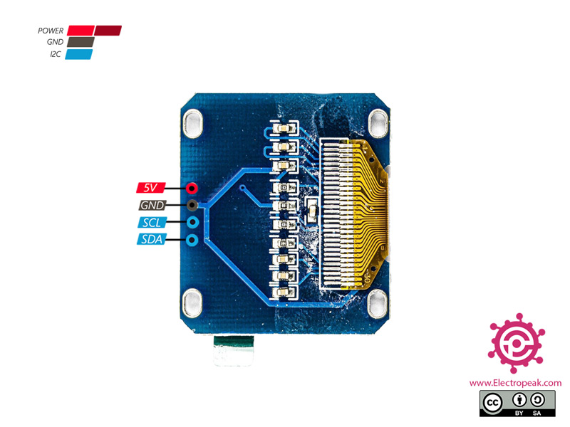

# 1.3" OLED display — SH1106 over I²C

Each node carries a 1.3" 128×64 monochrome OLED so the message travelling over
the Ethernet link is visible without a PC attached. Host A shows what it sent;
Host B shows what it received.

The panel is a **QG-2864KSWLG01** and the controller is an **SH1106G** — see
[the datasheet](3nfR8M2Am86tmUNdMO8j8wvWXkTdW8tsHJ4XG1fn.pdf), mechanical
drawing note 2 and section 4.1.

## Two things that will cost you a part or an evening

### Power the module from 3.3 V, not 5 V

The module is sold as a 5 V part and its silkscreen says `5V`. **Do not feed
it 5 V here.** The SDA and SCL pull-up resistors on the breakout go to the
module's own VCC, so a 5 V-powered module presents 5 V on the I²C lines. Those
lines go straight into a Cyclone IV bank running at 3.3 V, which is over its
absolute maximum.

Powering the module at 3.3 V puts the pull-ups at 3.3 V and makes the whole
thing directly FPGA-safe. This is also what the controller wants: the
datasheet gives VDD as **1.65–3.3 V** and states it "should be equal to MPU
I/O voltage".

Before connecting SDA and SCL to the FPGA, power the module alone and measure
both lines against ground. They idle high through the pull-ups, and you should
read ~3.3 V. If you read ~5 V, stop — either the module has its own regulator
that needs 5 V in, in which case you need a level shifter, or it is wired
straight through and you have it on the wrong rail.

### It is an SH1106, not an SSD1306, and the columns are offset by two

The SH1106 has **132 columns of display RAM with the 128-pixel panel centred
in it**, so panel column 0 is RAM column 2. Every page must set the column
address to `0x02` / `0x10` rather than `0x00` / `0x10`. The panel datasheet's
own init listing does exactly this — `write_i(0x02); /*set lower column
address*/` on page 21.

Miss it and the image is shifted two pixels right with the rightmost two
columns wrapped around to the left edge. Because an SSD1306 driver *almost*
works on this panel, this is the single most common SH1106 bug.

> **The datasheet contradicts itself here.** The reference schematic on page 15
> is labelled "SSD1306" and "Active Area 0.96''". That is a copy-paste error in
> the vendor document. The authoritative statements are the mechanical drawing
> ("Driver IC: SH1106G") and section 4.1 ("Refer to the Technical Manual for
> the SH1106"). Trust those.

## Wiring

Two more female-to-female jumpers per node, on the next free row of the same
fixed-3.3 V right-hand header.

| Wire | FPGA board | Which header | OLED module |
|---|---|---|---|
| `oled_scl` | `85` | right, row 5 left | `SCL` |
| `oled_sda` | `86` | right, row 5 right | `SDA` |
| VCC | `3.3V` | **top**, right end | `VCC` — **3.3 V, not 5 V** |
| GND | `GND` | right, bottom | `GND` |

No FPGA-side pull-ups are enabled and none are needed; the module carries
4.7 kΩ resistors to its own VCC. `i2c_master` drives the lines properly
open-drain — it only ever pulls low, and releases to high-Z otherwise.

Pins 85 and 86 are I/O **bank 5** while the ENC28J60 signals are bank 6. Both
sit on the same fixed-3.3 V right header, so this makes no practical
difference; it is only worth knowing if you read the fitter's bank report.

## How the driver works

| File | Role |
|---|---|
| [`rtl/i2c_master.v`](../rtl/i2c_master.v) | Byte-level I²C master, write-only, open-drain, 400 kHz |
| [`rtl/oled_sh1106.v`](../rtl/oled_sh1106.v) | Init sequence, page addressing, text rendering |
| [`rtl/font5x8.mem`](../rtl/font5x8.mem) | ASCII 32–126, 5 bytes per glyph, column-major |
| [`tools/mkfont.ps1`](../tools/mkfont.ps1) | Regenerates the font — do not hand-edit the `.mem` |
| [`tb/tb_oled.v`](../tb/tb_oled.v) | Self-checking testbench against a behavioural SH1106 |

**Layout.** A 4 × 21 character buffer renders to display pages 0, 2, 4 and 6,
leaving the odd pages blank so the lines have air between them. Glyphs are 5×8
with a one-column gap, so 21 characters span 126 of the 128 columns.

**Init.** Taken from datasheet section 4.4, with one deliberate change: the
charge pump is `0xAD 0x8B` (internal DC-DC on) rather than the datasheet's
`0x8A` (external VCC). The datasheet describes the bare panel, where VCC
arrives from outside; the 4-pin breakout has no external VCC pin, so the
SH1106 has to generate it. Using `0x8A` on a breakout gives a display that
initialises perfectly and stays dark.

**Order of operations.** Initialise, clear all eight pages, *then* send display
on (`0xAF`). Powering the panel on before clearing shows whatever the RAM came
up with. The testbench asserts that `0xAF` never arrives before the clear pass
finishes.

**Memory.** Both the font ROM and the character buffer are read synchronously
so they infer M9K blocks. Cyclone IV E has no LUT RAM, so an asynchronous read
would become flip-flops plus a wide mux — roughly 700 LEs for the character
buffer alone. The FSM stalls on the I²C master for tens of microseconds per
byte, so a cycle of read latency costs nothing.

**Refresh cost.** A full repaint is 8 pages × (3 command bytes + 128 data
bytes) ≈ 1,100 bytes ≈ 10 kbit at 400 kHz ≈ **25 ms**. Fine for a message
display; it is not a framebuffer.

## What the display shows

```
EP4CE6E22 ENC28J60
EREVID 0x06 OK
HOST A 192.168.1.60
MSG --
```

Line 1 is live: the EREVID readback in hex plus OK/BAD, repainted whenever the
value changes, so a wire coming loose shows on the panel and not only on the
LEDs. Line 2 identifies the node from the `HOST_ID` parameter.

Line 3 is the integration point. Today it holds a placeholder. Once milestone 4
lands, the UDP receive path writes the payload through the same `txt_we` /
`txt_addr` / `txt_char` port and pulses `refresh` — Host A writes what it
transmits, Host B writes what it receives.

## Verification

`tb/tb_oled.v` drives the real driver against a behavioural SH1106 I²C slave
and self-checks:

- the slave address byte is `0x78` (7-bit `0x3C`, write)
- all 25 init bytes arrive in datasheet order
- the charge pump is `0xAD 0x8B`, not `0x8A`
- **every one of the 16 page transactions sets column `0x02` / `0x10`** — the
  SH1106 offset
- all eight pages receive 128 bytes on the clear pass and 128 on the paint pass
- `0xAF` is sent, and only after the clear pass
- text written to the buffer arrives as the correct glyph bytes — `H` renders
  as `7f 08 08 08 7f` followed by a blank gap column

Result: **PASS**, no NACKs.

```
INFO: starts=34 stops=18 cmd_n=74 page_cmds=18 col_lo=16 col_hi=16
PASS: SH1106 init, 0x02/0x10 column offset on all 18 pages, 8 pages painted, text rendered
```

Quartus 25.1 with the OLED integrated: 0 errors, **602 / 6,272 LE (10 %)**,
4,472 memory bits, +4.53 ns setup and +0.43 ns hold slack.

Still **not tested on hardware** — like the rest of this repo.

## The message protocol (milestone 4)

Deliberately trivial, because the demo is about the link and not the encoding:
a UDP datagram to port 1234 whose payload is the ASCII message, up to 21
characters. Host A sends `Hello World`, Host B writes the payload into line 3
of its character buffer and refreshes.

Longer payloads are truncated at 21 characters rather than wrapped; anything
outside printable ASCII renders blank.

## Module pinout



Four pins only. Despite the `5V` label, wire VCC to 3.3 V here -- see the
warning at the top of this page. Image credit as per
[docs/wiring.md](wiring.md#image-credits).
