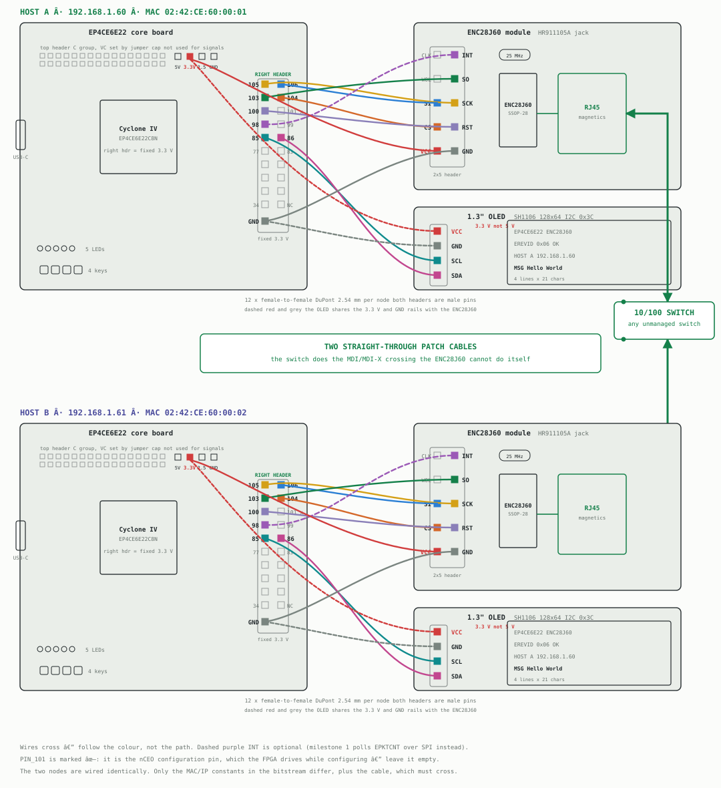
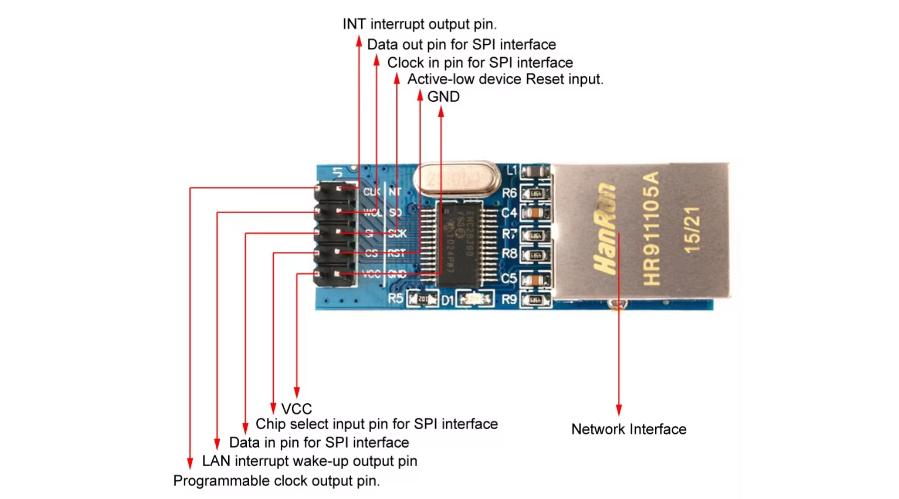
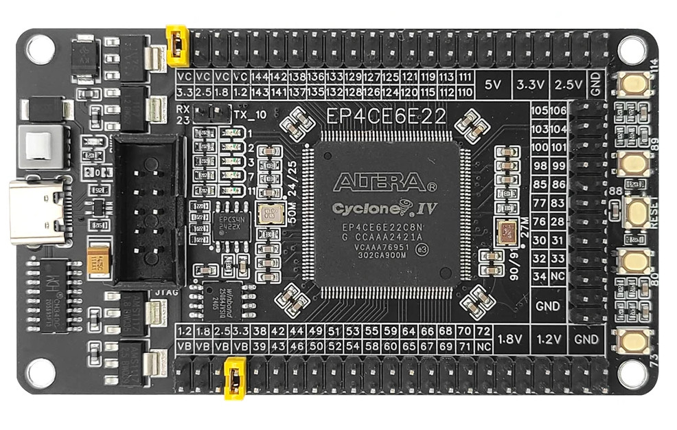
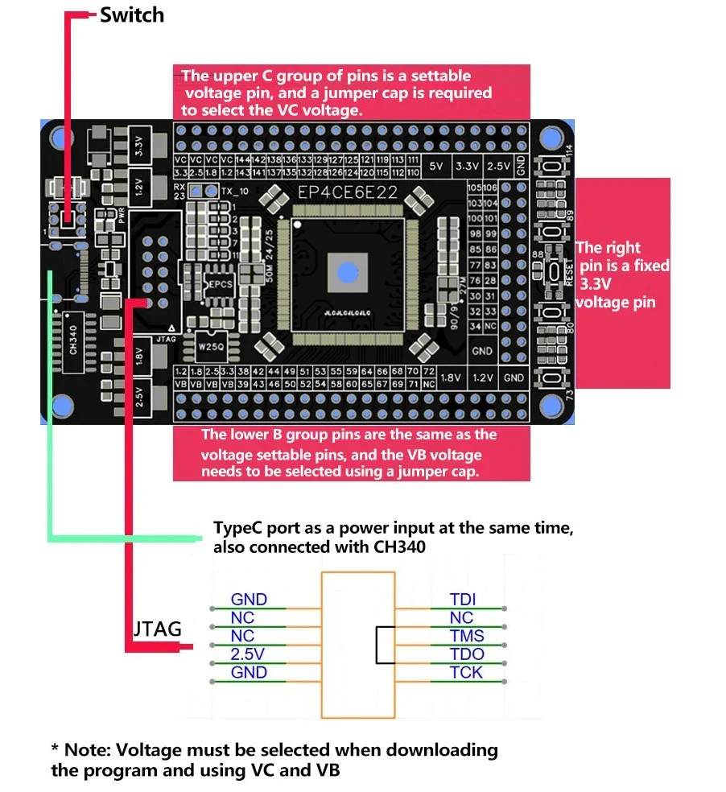

# Two-node wiring: Host A ⇄ Host B

Two identical EP4CE6E22 + ENC28J60 nodes joined by one LAN cable.



Eight jumpers per node, sixteen in total. Wires cross in the drawing — follow
the colour, not the path. The dashed purple `INT` line is optional; milestone
1 polls `EPKTCNT` over SPI instead. `PIN_101` is marked ✗ because it is the
`nCEO` configuration pin; see below.

## The cable must be a crossover

The ENC28J60 has **no Auto-MDIX**, and with no switch in this topology there is
nothing to do the crossing for you. A straight-through patch cable wires
transmitter to transmitter and the link LED never comes on.

Use a crossover cable (T568A crimped on one end, T568B on the other), or drop
any 10/100 switch between the two boards and use two ordinary patch cables.

| Host A RJ45 | | Host B RJ45 |
|---|---|---|
| 1 TX+ | → | 3 RX+ |
| 2 TX− | → | 6 RX− |
| 3 RX+ | ← | 1 TX+ |
| 6 RX− | ← | 2 TX− |
| 4, 5, 7, 8 | — | unused at 10Base-T |

## Per-board connections (identical on both hosts)

Eight female-to-female 2.54 mm DuPont jumpers per node, sixteen in total. Both
headers present male pins, so F-F is the correct cable and no breadboard is
needed.

| Wire | FPGA board | Which header | ENC28J60 | Module row | IC pin |
|---|---|---|---|---|---|
| `enc_sck`   | `105`  | right, row 1 left  | `SCK`  | 3 right | 8  |
| `enc_mosi`  | `106`  | right, row 1 right | `SI`   | 3 left  | 7  |
| `enc_miso`  | `103`  | right, row 2 left  | `SO`   | 2 right | 6  |
| `enc_cs_n`  | `104`  | right, row 2 right | `CS`   | 4 left  | 9  |
| `enc_rst_n` | `100`  | right, row 3 left  | `RST`  | 4 right | 10 |
| `enc_int`   | `98`   | right, row 4 left  | `INT`  | 1 right | 4  |
| VCC         | `3.3V` | **top**, right end | `VCC`  | 5 left  | 28 |
| GND         | `GND`  | right, bottom      | `GND`  | 5 right | 2  |

Left empty on the module: `CLK` (programmable clock output — the FPGA has its
own 50 MHz oscillator) and `WOL` (wake-on-LAN — nothing here sleeps).

### The ENC28J60 2×5 header

Silkscreen order on the HanRun/HR911105A module, reading down with the RJ45 to
the right:

```
CLK | INT
WOL | SO
SI  | SCK
CS  | RST
VCC | GND
```



All ten pins are present on every module, but **the physical order differs
between vendors** — match by printed label, not by position in this photo.

`TPOUT±` → RJ45 pins 1,2 and `TPIN±` ← RJ45 pins 3,6 are wired inside the
breakout through the magnetics, along with the RBIAS resistor and
termination. You never touch them.

### Use the right-hand FPGA header, not the top or bottom



The EP4CE6E22 board has three I/O headers and they are not equivalent:

- **Right-hand header — fixed 3.3 V, I/O bank 6.** All six signals go here.
  Two columns, reading down: `105|106`, `103|104`, `100|101`, `98|99`,
  `85|86`, `77|83`, `76|78`, `30|31`, `32|33`, `34|NC`, then `GND` at the
  bottom. Using the top rows keeps the whole SPI bus on one connector with
  ground on the same strip.
- **Top header (C group) and bottom header (B group) — bank 7, voltage set by
  a jumper cap** to 3.3, 2.5, 1.8 or 1.2 V. The ENC28J60 drives `SO` and `INT`
  at 3.3 V, so an FPGA input there with VC/VB jumpered low is over-driven.
  An earlier revision of this project used `PIN_110`/`PIN_111` from the C
  group for exactly that reason — don't go back to it. The only thing taken
  from the top header now is the `3.3V` *power* pin, which is a fixed rail and
  not bank-dependent.

> **`PIN_101` is deliberately skipped.** It is the `nCEO` configuration pin.
> Quartus will release it as regular I/O with
> `CYCLONEII_RESERVE_NCEO_AFTER_CONFIGURATION`, but the FPGA *drives* nCEO
> during configuration while the ENC28J60 drives `INT` — output against
> output, every time the board configures. `INT` lives on `PIN_98` instead.

> **Match the module header by printed label, not by position.** ENC28J60
> breakouts ship with several different 2×5 layouts between vendors. The order
> above is from the HanRun module shown in the photo.

The board vendor's own annotated diagram states the rule directly — "the right
pin is a fixed 3.3V voltage pin", while both the C and B groups need a jumper
cap to select VC/VB:



That same diagram gives the JTAG header pinout, which is worth having when
wiring a USB-Blaster: `GND / NC / NC / 2.5V / GND` down one side and
`TDI / NC / TMS / TDO / TCK` down the other.

### Power

The board carries an AMS1117-3.3 and brings a `3.3V` pin out at the right end
of the top header, so **take VCC from that pin**. It is one jumper instead of
a separate supply, and the regulator has headroom on paper: the module's
~180 mA transmit peak against a part rated 1 A, dissipating roughly 0.3 W
extra in a SOT-223 package.

Two conditions. Feed the board from a real USB-C supply or a powered hub
rather than a low-current laptop port, and keep 100 nF + 10 µF decoupling at
the module — the current spikes when the transmitter fires are what upset a
shared rail, not the average draw.

**The symptom that means you need a separate supply:** the link works at idle
but drops, resets, or corrupts frames specifically while transmitting, or the
FPGA re-configures under load. That is rail sag, not a logic bug. Move VCC to
its own 3.3 V supply with grounds tied together rather than debugging the RTL.

## What differs between the hosts

Nothing in the wiring — two constants in the bitstream.

| | Host A | Host B |
|---|---|---|
| IP | `192.168.1.60` | `192.168.1.61` |
| MAC | `02:42:CE:60:00:01` | `02:42:CE:60:00:02` |
| Bitstream | `eth_A.sof` | `eth_B.sof` |

Both MACs are locally administered (bit 1 of the first octet set) so they
cannot collide with a real vendor address. Build both images from one source:

```verilog
module eth_top #(
    parameter [7:0]  HOST_ID  = 8'd1,          // 1 = Host A, 2 = Host B
    parameter [47:0] MAC_ADDR = {40'h0242CE6000, HOST_ID},
    parameter [31:0] IP_ADDR  = {24'hC0A801, 8'd59 + HOST_ID}
) ( ... );
```

## This topology unlocks full duplex

The ENC28J60 cannot auto-negotiate, which is why a switch always falls back to
10 Mbit/s half duplex. Two ENC28J60s on a direct crossover cable have no
negotiating partner to disagree with: set `PHCON1.PDPXMD` and `MACON3.FULDPX`
on **both** boards and the link runs full duplex, ~9.5 Mbit/s each way
simultaneously.

Set it on only one side and you get a duplex mismatch — late collisions and
throughput that collapses under load. Both or neither.

## Bring-up order

1. **Ground first.** The `GND` jumper from the bottom of the right-hand header
   to the module's `GND`, before any other wire.
2. **Then VCC** from the top header's `3.3V` pin. Power the board and confirm
   3.3 V at the module before adding signals — its power LED should light.
3. **Then the five required signals** — SCK, SI, SO, CS, RST. Leave INT for
   later; milestone 1 does not use it.
4. **Test each board alone.** Confirm `EREVID` = `0x06` with no cable
   attached. A board that cannot reach its own controller over SPI will not be
   fixed by plugging in Ethernet.
5. **Then the crossover cable.** Link LEDs on both modules should light within
   a second. Exactly one lit → suspect the cable. Neither lit → suspect PHY
   init.
6. **Then ARP.** Host A ARPs for Host B's IP. A reply proves the whole path in
   both directions: SPI out, transmit, cable, receive, SPI in.
7. **Then throughput.** Host A streams 1,472-byte sequence-numbered UDP
   datagrams; Host B counts bytes and gaps.

## Image credits

`wiring-diagram.svg` is original work of this project and is covered by the
repository's MIT licence like the rest of the source.

The board photographs and the panel datasheet in this directory —
`pinout-ENC28J60.png`, `pinlayout-EP4CE6E22-fpga_board.jpg`,
`pinout-EP4CE6E22-fpga_board_info.jpg`, `1.3inch-oled-pin.jpg` and
`3nfR8M2Am86tmUNdMO8j8wvWXkTdW8tsHJ4XG1fn.pdf` (the QG-2864KSWLG01 / SH1106
datasheet) — are **vendor product, manual and datasheet material**, reproduced
here for identification and reference. They are not original work of this
project and are **not covered by the repository's MIT licence**, which applies
to the source code and written documentation only.

If you are the rights holder and would prefer they were removed, please open
an issue and they will be taken down.
